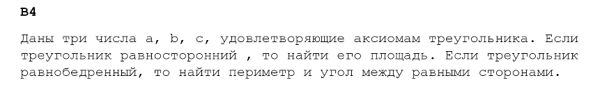
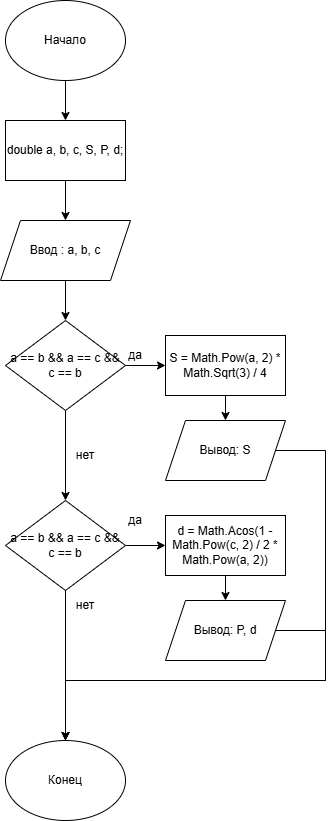
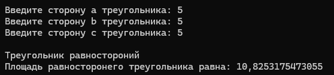
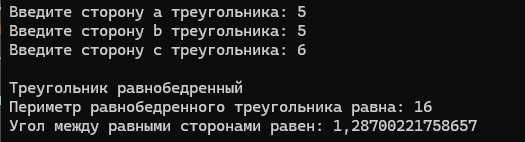
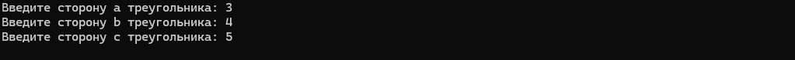
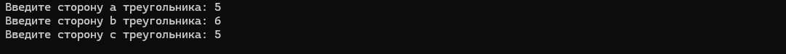
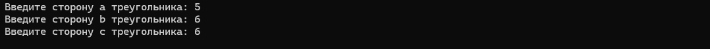

# Практическая работа №2 #

### Тема: Тестирование мотодом "белого ящика" ###

### Цель: Изучить методы тестированя логики программы, формализованные описания результатов тестирования и стандарты по составлению схем программ. ###

#### Ход работы: ####

#### Вариант 4 ####

##### Задача: #####



##### Задача: #####

##### Код программы: #####


````csharp
static void Main(string[] args)
{
    double a, b, c, S, P, d;
    Console.Write("Введите сторону a треугольника: ");
    a = Convert.ToDouble(Console.ReadLine());
    Console.Write("Введите сторону b треугольника: ");
    b = Convert.ToDouble(Console.ReadLine());
    Console.Write("Введите сторону c треугольника: ");
    c = Convert.ToDouble(Console.ReadLine());

    if (a == b && a == c && c == b)
    {
        Console.WriteLine("\nТреугольник равностороний");
        S = Math.Pow(a, 2) * Math.Sqrt(3) / 4;
        Console.WriteLine($"Площадь равносторонего треугольника равна: {S}");
    }
    else if (a == b)
    {
        Console.WriteLine("\nТреугольник равнобедренный");
        P = 2 * a + c;
        d = Math.Acos(1 - Math.Pow(c, 2) / (2 * Math.Pow(a, 2)));
        Console.WriteLine($"Периметр равнобедренного треугольника равна: {P}\nУгол между равными сторонами равен: {d}");
    }

````
##### Метод покрытия решений: #####

| Тест | Ожидаемый результат | Фактический результат | Результат тестирования |
|---|---|---|---|
| A = 5, B = 5, C = 5 | S = 10,825 | S = 10,825 | Успешно |
| A = 5, B = 5, C = 6 | P = 16, d = 1,2870 | P = 16, d = 1,2870 | Успешно |
| A = 3, B = 4, C = 5 | Ничего не выведено | Ничего не выведено | Успешно |

---

##### Метод покрытия условий: #####
| Тест | Ожидаемый результат | Фактический результат | Результат тестирования |
|---|---|---|---|
| A = 5, B = 5, C = 5 | S = 10,825 | S = 10,825 | Успешно |
| A = 5, B = 5, C = 6 | P = 16, d = 1,2870 | P = 16, d = 1,2870 | Успешно |
| A = 5, B = 6, C = 5 | Ничего не выведено | Ничего не выведено | Неуспешно (баг: треугольник равнобедренный, но не обработан) |
| A = 5, B = 6, C = 6 | Ничего не выведено | Ничего не выведено | Неуспешно (баг: треугольник равнобедренный, но не обработан) |

---


#### Результат работы программы: ####  
##### Тест A = 5, B = 5, C = 5
   
##### Тест A = 5, B = 5, C = 6
  
##### Тест A = 3, B = 4, C = 5
  
##### Тест A = 5, B = 6, C = 5
   
##### Тест A = 5, B = 6, C = 6
  

Вывод: я изучил методы тестирование логики программы с помощью метода покрытия решений и метода покрытия условий.