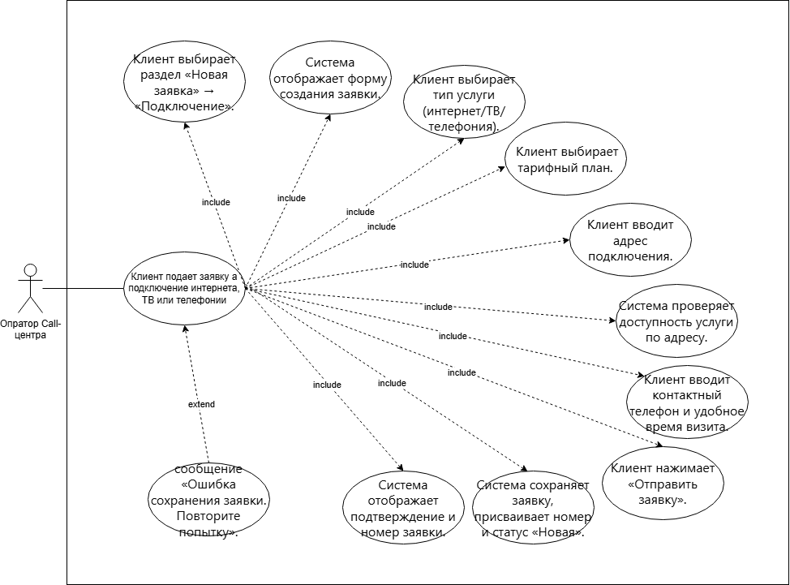
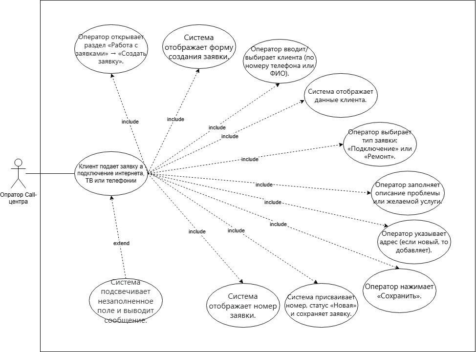
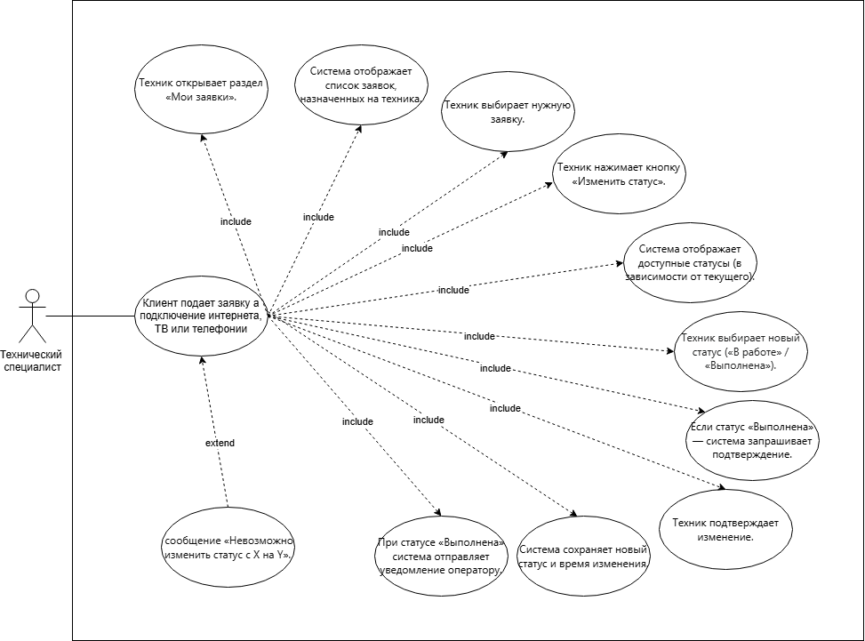

# Практическая работа №7-8 #

### Тема: Изучение и методы тестирования бизнес процессов программных модулей. ###

### Цель: выявить и описать пользовательские требвания в виде вариантов испльзования (Use Cases)б. ###

### Тема индивидуального задания: Разработка АИС «Обработка заявок на ремонт и подключение для телекоммуникационных компаний» ###

### Фио: Сивоглаз И.Р. ###

### Группа: 2ИСП-09 ###

## 1. Описание вариантов использования программного продукта

### 1.1. акторы

| № | Актор | Описание |
|----|-------|----------|
| 1 | Клиент | Пользователь услуги, который подаёт заявки на подключение или ремонт, проверяет статус, просматривает историю |
| 2 | Оператор call-центра | Сотрудник, создающий заявки со слов клиента, регистрирующий клиентов и просматривающий историю |
| 3 | Технический специалист | Сотрудник, выполняющий заявки, изменяющий их статус |
| 4 | Администратор системы | Сотрудник, назначающий исполнителей, формирующий отчёты, управляющий сотрудниками и ролями |

### 1.2. Варианты использования

| UC | Название | Актор |
|----|----------|-------|
| UC-1 | Подать заявку на подключение | Клиент |
| UC-2 | Подать заявку на ремонт | Клиент |
| UC-3 | Проверить статус заявки | Клиент |
| UC-4 | Просмотреть историю заявок | Клиент |
| UC-5 | Отменить заявку | Клиент |
| UC-6 | Зарегистрироваться в ЛК | Клиент |
| UC-7 | Создать заявку (от имени клиента) | Оператор |
| UC-8 | Зарегистрировать клиента | Оператор |
| UC-9 | Назначить исполнителя | Администратор |
| UC-10 | Изменить статус заявки | Техник |
| UC-11 | Сформировать отчёт | Администратор |

### 1.3. Полное описание трёх вариантов использования

Ниже приведены **три ключевых варианта использования** для разных акторов.

---

## UC-1: Подать заявку на подключение

| Параметр | Значение |
|----------|----------|
| **Идентификатор и название** | UC-1 Подать заявку на подключение |
| **Основное действующее лицо** | Клиент |
| **Краткое описание** | Клиент через личный кабинет создаёт заявку на подключение интернета, ТВ или телефонии, указывая адрес, тариф и контактные данные |
| **Предварительные условия** | PRE-1: Клиент авторизован в личном кабинете. PRE-2: Адрес подключения технически доступен для выбранной услуги |
| **Выходные условия** | POST-1: Заявка сохранена в БД со статусом «Новая». POST-2: Заявке присвоен уникальный номер. POST-3: Оператор получает уведомление о новой заявке |
| **Нормальное направление** | 1. Клиент выбирает раздел «Новая заявка» → «Подключение». 2. Система отображает форму создания заявки. 3. Клиент выбирает тип услуги (интернет/ТВ/телефония). 4. Клиент выбирает тарифный план. 5. Клиент вводит адрес подключения. 6. Система проверяет доступность услуги по адресу. 7. Клиент вводит контактный телефон и удобное время визита. 8. Клиент нажимает «Отправить заявку». 9. Система сохраняет заявку, присваивает номер и статус «Новая». 10. Система отображает подтверждение и номер заявки. |
| **Альтернативное направление** | **Шаг 6a. Услуга недоступна по адресу** 1. Система выводит сообщение «Услуга по указанному адресу недоступна». 2. Система предлагает список доступных услуг по этому адресу. 3. Клиент выбирает другую услугу или изменяет адрес. 4. Возврат к шагу 6 нормального направления. |
| **Исключения** | **Шаг 9.E1. Ошибка сохранения в БД** 1. Система выводит сообщение «Ошибка сохранения заявки. Повторите попытку». 2. Клиент повторяет отправку. 3. При повторной ошибке клиенту предлагается обратиться в поддержку. |

## UC-7: Создать заявку (от имени клиента)

| Параметр | Значение |
|----------|----------|
| **Идентификатор и название** | UC-7 Создать заявку от имени клиента |
| **Основное действующее лицо** | Оператор call-центра |
| **Краткое описание** | Оператор принимает звонок от клиента и создаёт заявку на подключение или ремонт, заполняя данные со слов клиента |
| **Предварительные условия** | PRE-1: Оператор авторизован в системе. PRE-2: Клиент идентифицирован (найден в БД или зарегистрирован) |
| **Выходные условия** | POST-1: Заявка сохранена в БД. POST-2: Заявке присвоен статус «Новая». POST-3: Клиенту сообщён номер заявки |
| **Нормальное направление** | 1. Оператор открывает раздел «Работа с заявками» → «Создать заявку». 2. Система отображает форму создания заявки. 3. Оператор вводит/выбирает клиента (по номеру телефона или ФИО). 4. Система отображает данные клиента. 5. Оператор выбирает тип заявки: «Подключение» или «Ремонт». 6. Оператор заполняет описание проблемы или желаемой услуги. 7. Оператор указывает адрес (если новый, то добавляет). 8. Оператор нажимает «Сохранить». 9. Система присваивает номер, статус «Новая» и сохраняет заявку. 10. Система отображает номер заявки. |
| **Альтернативное направление** | **Шаг 3a. Клиент не найден в БД** 1. Система предлагает зарегистрировать нового клиента. 2. Оператор вводит ФИО, телефон, адрес. 3. Система сохраняет данные клиента. 4. Возврат к шагу 4 нормального направления. |
| **Исключения** | **Шаг 9.E1. Не заполнено обязательное поле** 1. Система подсвечивает незаполненное поле и выводит сообщение. 2. Оператор заполняет поле. 3. Возврат к шагу 9. |

## UC-10: Изменить статус заявки

| Параметр | Значение |
|----------|----------|
| **Идентификатор и название** | UC-10 Изменить статус заявки |
| **Основное действующее лицо** | Технический специалист (Техник) |
| **Краткое описание** | Техник обновляет статус заявки по мере выполнения: «В работе», «Выполнена», «Отклонена» |
| **Предварительные условия** | PRE-1: Техник авторизован в системе. PRE-2: Заявка назначена на этого техника. PRE-3: Текущий статус заявки позволяет изменение |
| **Выходные условия** | POST-1: Статус заявки обновлён. POST-2: В системе зафиксировано время изменения статуса. POST-3: При статусе «Выполнена» оператор получает уведомление |
| **Нормальное направление** | 1. Техник открывает раздел «Мои заявки». 2. Система отображает список заявок, назначенных на техника. 3. Техник выбирает нужную заявку. 4. Техник нажимает кнопку «Изменить статус». 5. Система отображает доступные статусы (в зависимости от текущего). 6. Техник выбирает новый статус («В работе» / «Выполнена»). 7. Если статус «Выполнена» — система запрашивает подтверждение. 8. Техник подтверждает изменение. 9. Система сохраняет новый статус и время изменения. 10. При статусе «Выполнена» система отправляет уведомление оператору. |
| **Альтернативное направление** | **Шаг 6a. Техник выбирает статус «Отклонена»** 1. Система запрашивает причину отклонения (текстовое поле). 2. Техник вводит причину. 3. Система сохраняет статус и причину. 4. Система уведомляет оператора и клиента. |
| **Исключения** | **Шаг 9.E1. Недопустимый переход статуса** 1. Система выводит сообщение «Невозможно изменить статус с X на Y». 2. Техник возвращается к списку доступных статусов. 3. Повторный выбор корректного статуса. |

### 2.3. Описание связей

- **Клиент** взаимодействует с системой через личный кабинет: подаёт заявки, проверяет статус, просматривает историю, отменяет заявки, регистрируется.
- **Оператор** создаёт заявки со слов клиента и регистрирует новых клиентов.
- **Техник** изменяет статус заявок по мере выполнения работ.
- **Администратор** назначает исполнителей на заявки и формирует отчёты.

